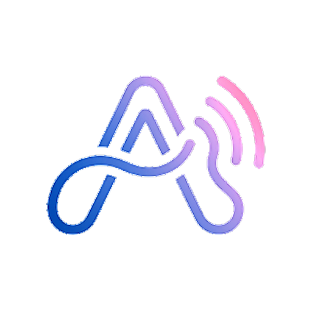

# AURA — Audiophile Cinematic Music Player

<div align="center">

  

  <h3>Cosmic Minimalism • Precision Glassmorphism • Audiophile Sound</h3>

  <p>
    A high-fidelity, sensory-driven mobile music player engineered for discerning audiophiles, nocturnal listeners, and curators.
  </p>

  <p>
    <a href="#-download-apk">Download APK</a> •
    <a href="#key-features">Key Features</a> •
    <a href="#architecture--tech-stack">Architecture</a> •
    <a href="#getting-started">Getting Started</a> •
    <a href="#web-prototype">Web Prototype</a> •
    <a href="#design-system">Design System</a>
  </p>

  <p>
    <a href="https://github.com/Pranavpawar-coder/Aura-/releases/latest">
      
    </a>
  </p>

  <p>
    
    
    
    
    
    
  </p>

</div>

---

## 📥 Download APK

You can download the latest compiled builds directly from the [GitHub Releases](https://github.com/Pranavpawar-coder/Aura-/releases/latest) section:

| Build Flavor | File | Description |
| :--- | :--- | :--- |
| **Release Build (Recommended)** | `Aura-release.apk` | ProGuard/R8 optimized & shrunk binary (~4.5 MB) |
| **Debug Build** | `Aura-debug.apk` | Development build with debug logging enabled (~7.8 MB) |

### Installation & Laptop Setup
- **On Android Device:** Download `Aura-release.apk`, tap to install (allow "Install unknown apps" if prompted), and launch AURA.
- **On Laptop / Desktop:**
  - **Android Studio Emulator:** Drag-and-drop `Aura-release.apk` directly onto any running Android Virtual Device (AVD).
  - **ADB Command Line:** Run `adb install Aura-release.apk` from PowerShell / terminal.
  - **Windows Subsystem for Android (WSA):** Sideload with `adb connect 127.0.0.1:58526 && adb install Aura-release.apk`.

---

## 🌟 Overview

**AURA** is a modern music player crafted around **Atmospheric Glassmorphism** and **Cosmic Minimalism**. It breaks free from generic list-based audio players by turning music playback into an immersive, tactile art form.

Surfaces react dynamically to song album art, casting soft spectral auroras across translucent frosted glass panels, while a studio-grade DSP audio pipeline ensures bit-perfect playback and deep soundstage customization.

AURA includes both:
1. **Native Android Application:** Built with 100% Kotlin, Jetpack Compose, Material 3, AndroidX Media3 (ExoPlayer), Room Database, and real-time DSP audio processing.
2. **Interactive Web Prototype & Studio:** Complete Web Audio API simulation with synced lyrics and mobile shell simulation built with Tailwind CSS.

---

## ✨ Key Features

### ⚡ Cloud & Song Downloader (Lossless & Hi-Fi)
- **Spotify & Universal URL Resolver:** Paste Spotify track, album, or playlist links—or search directly by song title and artist—to discover high-fidelity tracks.
- **Multi-Quality Stream Engine:**
  - 🎼 **FLAC Lossless (16-bit / 44.1kHz):** Pure CD-quality audio reproduction.
  - 💎 **Hi-Res FLAC (24-bit / 96kHz):** Studio master dynamic fidelity.
  - 🚀 **MP3 (320 kbps CBR & 192 kbps):** Compact, high-bitrate universal playback.
- **High-Speed Downloader Engine:** Multi-task concurrent downloading with real-time speed readouts, download progress, and pause/resume support.
- **Automated Metadata & Artwork Tagging:** Writes high-resolution album artwork, ID3 tags (artist, album, year, track number, ISRC), and synchronizes downloaded songs directly into AURA's local library and MediaStore.
- **Live Synced Lyrics Retrieval:** Fetches and caches synchronized LRC lyrics during download.

### 🎛️ Studio-Grade DSP Audio Engine
- **10-Band Parametric & Graphic Equalizer:** Precision band adjustments with rich audio presets (*Acoustic, Bass Boost, Classical, Dance, Deep, Electronic, Hip Hop, Jazz, Metal, Pop, Rock, Vocal*).
- **Spatial 4D Soundstage:** Real-time 360° audio spatializer engine with an interactive radar visualizer and movement modes.
- **Dynamic Processing Pipeline:** Custom Biquad filters, peak limiter, dynamic range compressor, and ReplayGain loudness normalization.
- **Hardware & Software Effects:** Native Bass Boost, Virtualizer, and Reverb environments (*Room, Large Room, Hall, Plate*).
- **Hi-Res Audio Details:** Real-time technical audio spec readout for audiophiles (sample rate, bit depth, bitrate, and codec).

### 🎵 Playback & Background Media3 Engine
- **AndroidX Media3 / ExoPlayer:** Rock-solid background playback powered by `AuraAudioService` (`foregroundServiceType="mediaPlayback"`).
- **System MediaSession Integration:** Full lockscreen controls, notification actions, and Bluetooth / headset controls.
- **Audio Focus & Headphone Handling:** Automatic pause on disconnect and smooth transient audio ducking.
- **Queue & State Persistence:** Restores playlist queue, playback progress, and repeat/shuffle states across restarts.
- **Gapless Playback & Crossfade:** Seamless transitions between songs.
- **Smart Sleep Timer:** Configurable sleep timer with gradual volume fade-out.

### 🌌 Cinematic Now Playing & Dynamic Theme
- **Artwork-Reactive Ambient Aurora:** Uses Android Palette to extract dominant colors and cast luminous, animated gradients behind frosted glass.
- **Tri-Mode Center Display:**
  - 🎨 **Album Artwork:** Floating 3D album card with subtle tilt and shadow physics.
  - 🎤 **Live Synchronized Lyrics:** Real-time auto-scrolling LRC lyrics with tap-to-seek.
  - 📊 **Audio Visualizer:** Fluid animated frequency spectrum and equalizer bars.
- **Interactive Bottom Sheet & Gestures:** Swipe gestures to reveal queue, song details, and audio controls.

### 📚 Smart Library & File Discovery
- **Deep Storage Scanner:** High-performance Storage Access Framework (SAF) folder picker and recursive media scanner.
- **Flexible Library Organization:** Browse by **Songs, Albums, Artists, Playlists, Folders, and Genres**.
- **Comprehensive Sorting:** Sort by Title, Artist, Album, Date Added, Duration, Track Number, or File Size.
- **Smart Scan & Exclusion Rules:** Filter out short voice notes, ringtones, hidden folders, or unwanted directories.
- **Smart Playlists:** Auto-generated playlists for *Recently Added, Most Played, Favorites, and History*.
- **ID3 Tag & Metadata Editor:** In-app metadata editor for tags and album art.

### 📱 Modular Home Screen Widgets
Four responsive widget configurations rendered with Material You dynamic styling:
- **Compact (2×2):** Minimalist artwork tile with play/pause and track progress.
- **Standard Player (4×2):** Full playback controls, song info, and glowing album art.
- **SoundStage (4×3):** Large layout with quick-action controls, queue preview, and equalizer badge.
- **Responsive Dynamic Widget:** Automatically adapts to any launcher grid size.

### 📊 Listening Analytics & Insights
- Real-time listening stats showing favorite artists, top tracks, total listening time, and genre breakdowns.
- Local listening history tracking with instant replay.

---

## 🏗️ Architecture & Tech Stack

AURA adheres to **Clean Architecture** and **Unidirectional Data Flow (UDF)** patterns:

```
android/app/src/main/java/com/example/aura/
├── data/
│   ├── audio/           # Media3 Player Manager, DSP Pipeline, Spatial 4D Engine, Metadata Helper
│   ├── backup/          # Playlist & database export/import
│   ├── cloud/           # Lossless Stream Resolver, Spotify Metadata API & CDN Resolvers
│   ├── download/        # High-Speed Multi-Threaded Download Engine & ID3 Tagging
│   ├── exclusion/       # Smart scan & directory exclusion filters
│   ├── local/           # Room Database, DAOs, Entities, DataStore Preferences
│   ├── lyrics/          # LRC parser, synchronizer & local cache
│   ├── metadata/        # Audio tag extraction & normalizer
│   ├── repository/      # Repository implementations (Music, Playlist, Stats)
│   └── stats/           # Playback statistics & history engine
├── domain/
│   ├── model/           # Song, Playlist, QueueState, AudioEffectsState, Settings
│   │   └── cloud/       # CloudTrack, CloudCollection, DownloadTask, AudioQuality
│   └── repository/      # Abstract Repository Interfaces
├── theme/               # Cosmic Void colors, Typography, Glassmorphism modifiers
├── ui/
│   ├── audiofx/         # Equalizer, Spatial 4D Radar, Audio Effects Studio
│   ├── cloud/           # Cloud & Song Downloader Screen, Search, Quality Selection
│   ├── components/      # Reusable Glass cards, MiniPlayer, Visualizers, Dialogs
│   ├── home/            # Discovery screen, quick carousels, recent tracks
│   ├── library/         # Song, Album, Artist, Folder, and Playlist screens
│   ├── navigation/      # Navigation3 graph and bottom navigation bar
│   ├── nowplaying/      # Now Playing player, lyrics view, queue bottom sheet
│   ├── search/          # Instant search and filter chips
│   ├── settings/        # Audiophile settings, scanner config, appearance
│   └── viewmodel/       # PlayerViewModel, LibraryViewModel, StatsViewModel, CloudDownloaderViewModel
└── widget/              # AppWidget providers, RemoteViews layout managers
```

### Core Technologies
- **UI Toolkit:** [Jetpack Compose](https://developer.android.com/jetpack/compose) with Material 3 Design
- **Media Engine:** [AndroidX Media3 (ExoPlayer)](https://developer.android.com/media/media3)
- **Local Database:** [Room Database](https://developer.android.com/training/data-storage/room) with KSP schema tracking
- **Preferences:** [AndroidX DataStore](https://developer.android.com/topic/libraries/architecture/datastore)
- **Image Loading:** [Coil Compose](https://coil-kt.github.io/coil/compose/)
- **Color Extraction:** [AndroidX Palette](https://developer.android.com/develop/ui/views/graphics/palette-colors)
- **Navigation:** [AndroidX Navigation 3](https://developer.android.com/guide/navigation)

---

## 🎨 Design System

Derived from Google Stitch prototype specifications (**Cosmic Minimalism & Atmospheric Glassmorphism**):

| Token | Hex / Value | Description |
| :--- | :--- | :--- |
| **Void Canvas** | `#10131A` | Deep cosmic canvas optimized for OLED screens |
| **Surface Lowest** | `#0B0E15` | Structural background container |
| **Glass Surface** | `rgba(22, 27, 38, 0.65)` | Translucent floating frosted glass with `backdrop-filter: blur(24px)` |
| **Glass Hairline** | `rgba(255, 255, 255, 0.08)` | 1px luminous edge stroke |
| **Primary Accent** | `#CBE4FF` / `#7C5CFC` | Electric Violet & Radiant Indigo |
| **Secondary Accent**| `#AAC7FF` / `#0068D0` | Radiant Cyan & Sonic Blue |
| **Typography** | `Plus Jakarta Sans` | Modern geometric sans-serif typography |

*See [DESIGN_SYSTEM.md](file:///d:/Aura/DESIGN_SYSTEM.md) for full design specifications, typography scale, and elevation tokens.*

---

## 🚀 Getting Started

### Prerequisites
- **Android Studio:** Ladybug (2024.2.1+) or newer
- **JDK:** Version 17+
- **Android SDK:** Compile SDK 36, Target SDK 35, Min SDK 24 (Android 7.0+)

### Building and Running the Android App

1. **Clone the repository:**
   ```bash
   git clone https://github.com/Pranavpawar-coder/Aura-.git
   cd Aura-
   ```

2. **Open in Android Studio:**
   - Open Android Studio and select **Open**, navigating to the `android/` directory.

3. **Build the Debug APK:**
   ```bash
   cd android
   ./gradlew assembleDebug
   ```

4. **Run Unit Tests:**
   ```bash
   ./gradlew testDebugUnitTest
   ```

---

## 🌐 Web Prototype & Studio

In addition to the native Android app, AURA includes a browser-based prototype created with Tailwind CSS and Web Audio API:

- **Launch Interactive Web App:** Open `index.html` in any modern web browser or serve it with a local static server:
  ```bash
  npx serve .
  ```
- **Stitch Studio Overview:** Open `studio.html` to preview the interactive screens layout side-by-side.
- **Rebuild Prototype from Screens:**
  ```bash
  python build_app.py
  ```

---

## 📄 License

This project is licensed under the Apache License 2.0. See the LICENSE file for details.
